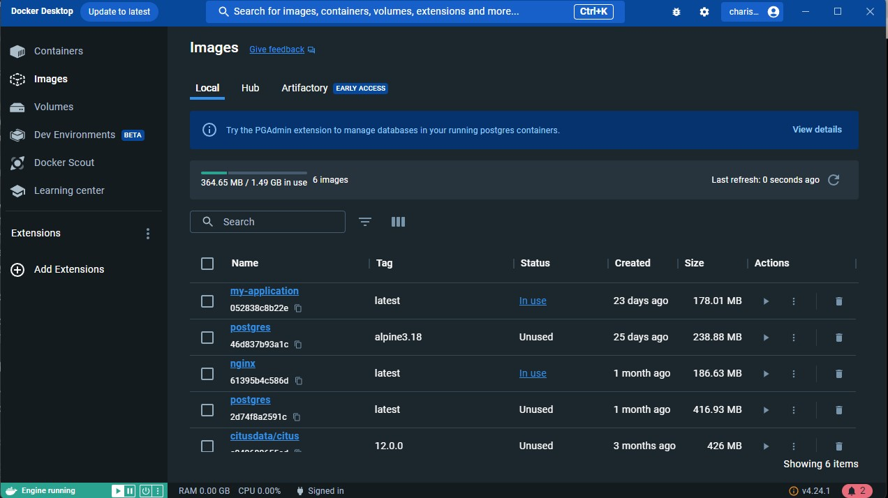
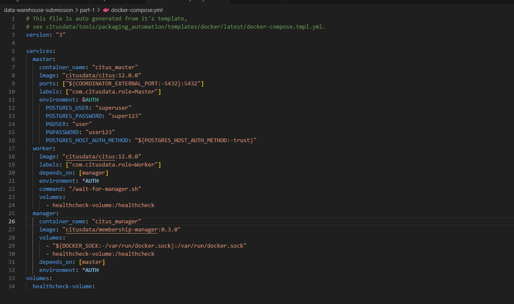
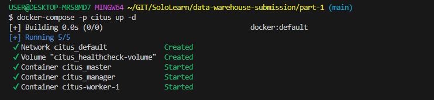
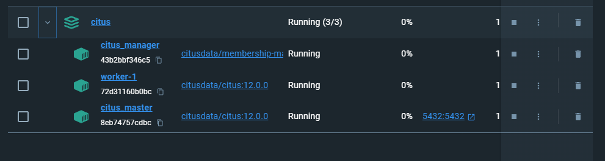
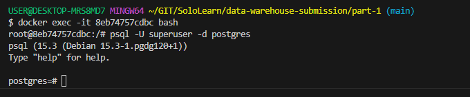
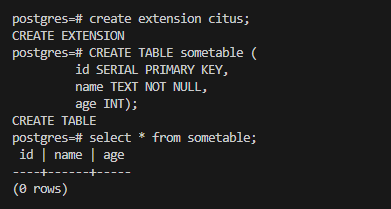

1. Sebutkan Perbedaan data warehouse dan data lake!
    Secara umum perbedaannya adalah sebagai berikut:
    Data Lake adalah tempat penyimpanan yang berisi data-data mentah dalam jumlah besar yang tujuannya mungkin belum ditentukan.
    Data Warehouse adalah tempat tersimpannya data yang sudah di saring dan tersimpan secara terstruktur sehingga siap untuk di proses untuk tujuan tertentu.
    
    - Struktur Data:
        Data Lake = Raw Data
        Data Warehouse = Processed
    - Tujuan Data :
        Data Lake = Belum ditentukan
        Data Warehouse = Digunakan untuk tujuan spesifik
    - Pengguna
        Data Lake = Data Scientist
        Data Warehouse = Bussiness Profesional
    - Aksesbilitas
        Data Lake = Mudah Di akses dan di Update
        Data Warehouse = Lebih rumit dan mahal untuk melakukan perubahan
    - Jenis Data yang disimpan:
        Data Lake = Beragam Jenis Data
        Data Warehouse = Data terstruktur

2. Apa yang membedakan teknologi database untuk data warehouse (OLAP) dari teknologi database konvensional (OLTP)?
    OLAP (Online Analytical Processing) dan OLTP - Online Transaction Processing adalah tipe database berdasarkan tujuan querynya.
    Perbedaannya cukup signifikan dari desain, tujuan , dan kinerjanya. Berikut perbedaan teknologi kedua database tersebut :

     1. Tujuan Utama:
        OLAP (Data Warehouse): Lebih ditujukan untuk mendukung analisis dan pengambilan keputusan. Data warehouse menyimpan data agregat, ringkasan, dan history untuk membantu pengguna dalam menganalisis tren, membuat laporan, dan mengeksplorasi data bisnis.
        OLTP (Database Konvensional): Lebih ditujukan untuk data yang bersifat transaksional sehari-hari dan operasi bisnis. Database OLTP digunakan untuk memasukkan, mengupdate, dan menghapus data dalam transaksi bisnis seperti pemesanan, penjualan, dan inventaris.
    
    2. Struktur Data:
        OLAP (Data Warehouse): Data dalam database OLAP sering kali terdenormalisasi dan diorganisasi untuk pengambilan data yang efisien. Ini berarti data diubah sedemikian rupa sehingga meminimalkan jumlah koneksi tabel, membuatnya lebih cocok untuk analisis kompleks.
        OLTP (Database Konvensional): Data dalam database OLTP biasanya normalisasi atau sudah normal, yang berarti data terpecah menjadi banyak tabel terkait untuk mengurangi redundansi dan menjaga konsistensi data selama transaksi.
    
    3.Ukuran Data:
        OLAP (Data Warehouse): Membutuhkan tempat penyimpanan yang lebih besar
        OLTP (Database Konvensional):Umumnya menyimpan data transaksi terbaru dan memiliki ukuran data yang lebih kecil.
    
    4. Skema Query:
        OLAP (Data Warehouse): Skema query yang digunakan lebih kompleks dan mendukung operasi analitis seperti grouping, aggregasi, dan operasi join yang lebih rumit.
        OLTP (Database Konvensional):Skema query yang digunakan lebih sederhana, yang cocok untuk operasi CRUD (Create, Read, Update, Delete) dalam transaksi bisnis.
    
    5. Kinerja:
        OLAP (Data Warehouse): Database OLAP dioptimalkan untuk kinerja pembacaan data yang tinggi dan kompleksitas query yang tinggi, yang berarti query analitis cenderung berjalan lebih cepat.
        OLTP (Database Konvensional): Database OLTP dioptimalkan untuk kinerja penulisan data dan transaksi cepat, yang lebih cocok untuk operasi bisnis sehari-hari.

3. Teknologi Apa saja yang biasanya dipakai untuk data warehouse?
    Data warehouse menggunakan berbagai teknologi dan alat untuk menyimpan, mengelola, dan menganalisis data bisnis. 
    Beberapa teknologi yang sering digunakan dalam lingkungan data warehouse meliputi:
    
    1. Sistem manajemen basis data/DBMS, contoh PostgreSQL, MySQL, Oracle, dBeaver, dll
    2. Sistem penyimpanan data, contoh hadoop, Amazon S3
    3. Tools untuk ETL/ELT, contoh Apache Spark
    4. Tools untuk Data Integration, contoh Apache Kafka
    5. Layanan Cloud(jika menggunakan cloud), contoh Google Big Query, Amazon Redshift
    6. Tools untuk Analisa data, contoh Tableau, Power BI
    7. Teknologi untuk menjaga keamanan data, contoh LDAP, korberos

4. Tuliskan setiap perintah dari proses instalasi citus menggunakan docker compose sampai tabel terbentuk, berikan juga tangkapan layar untuk setiap langkah dan hasilnya !
    1. Jalankan docker (Install jika belum ada) dan pastikan sudah terdapat postgre di dalamnya.
    
    2. Buat file docker-compose.yml sesuai di link https://github.com/citusdata/docker dan ubah beberapa data sesuai yang diinginkan.
    
    3. Jalankan file docker compose dengan perintah docker-compose -p citus up -d , kemudian cek di docker desktop untuk memastikan apakah container sudah terbuat.
    
    
    4. Jalankan perintah docker exec -it <container_id> bash agar bisa menjalankan perintah di dalam container. Kemudian jalankan perintah psql -U <POSTGRES_USER> -d postgres agar bisa mengakses postgrenya. Jika sudah sesuai dengan image-4 maka sudah konek ke postgreSQL dan postgre di dalam docker siap dan bisa digunakan.
    
    5. Jalankan perintah 'create extension citus;' (tanpa tanda petik) untuk memasang extension citus pada container postgre dimana nanti akan muncul CREATE EXTENSION jika citus telah terpasang. Kemudian anda bisa mulai membuat tabel,contohnya seperti perintah pada gambar di bawah ini. Jika sukses akan muncul pemberitahuan CREATE TABLE jika tabel sudah sukses dibuat. Anda bisa melakukan pengecekan dengan perintah select * from <nama_tabel> untuk meastikan tabel tersebut telah terbentuk atau belum.
    
    

5. Jelaskan Perbedaan antara access method heap dan columnar pada citus!
    Heap adalah metode akses dimana data disimpan dalam format row
    - Karakteristik:
        Data diakses dalam format keseluruhan baris, dan setiap baris diperlakukan sebagai satu unit saat diakses.
        Metode ini lebih cocok untuk operasi OLTP (Online Transaction Processing) di mana transaksi yang dilakukan adalah pengambilan, pembaruan, atau penghapusan data dalam jumlah kecil.
        
    - Keuntungan:
        Cocok untuk transaksi dan operasi CRUD (Create, Read, Update, Delete) yang sering terjadi dalam aplikasi bisnis sehari-hari.
        Membantu dalam pengolahan data dengan skema yang lebih kompleks dan hubungan antar tabel.
        
    - Kekurangan:
        Tidak efisien untuk operasi analitik yang melibatkan agregasi dan pemindaian kolom tertentu dari banyak baris, seperti dalam kasus analisis data besar.
    
    Columnar adalah metode akses dimana data disimpan dalam format column
    - Karakteristik:
        Data diakses dengan cara mengambil kolom-kolom yang spesifik. Cocok untuk operasi analitik dan aggregasi data.
        Membantu dalam kinerja query yang memerlukan pengambilan data dari kolom-kolom tertentu tanpa memerlukan data dari kolom lainnya.
        
    - Keuntungan:
        Sangat efisien untuk operasi analitik seperti penghitungan jumlah, pengurutan, dan agregasi data.
        Cocok untuk aplikasi yang melakukan query besar yang melibatkan pengolahan data dari kolom tertentu.
        
    - Kekurangan:
        Tidak seefisien jika diperlukan pembaruan, penghapusan, atau penggantian data dalam jumlah besar dan cepat.