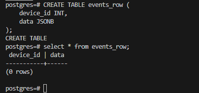
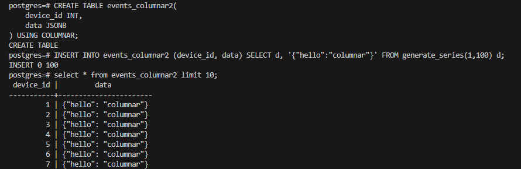
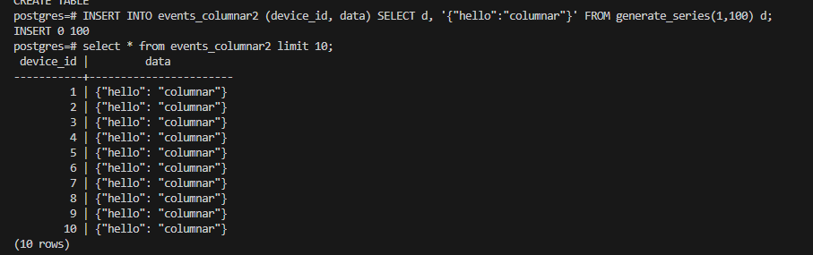
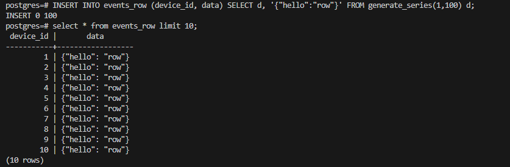
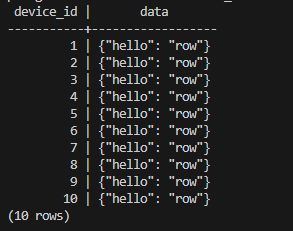
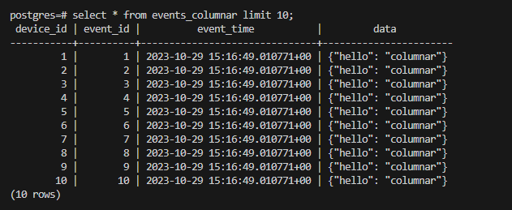
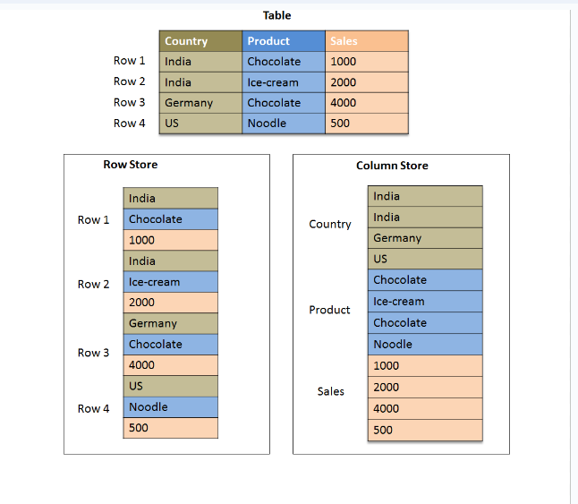

1. Jalankan citus di komputer lokal dengan menggunakan docker compose! 
    1. Jalankan docker (Install jika belum ada) dan pastikan sudah terdapat postgre di dalamnya.
    2. Buat file docker-compose.yml dengan konfigurasi seperti di link https://github.com/citusdata/docker
    3. Jalankan file docker compose dengan perintah docker-compose -p citus up -d , kemudian cek di docker desktop untuk memastikan apakah container sudah terbuat.
    4. Jalankan perintah docker exec -it <container_id> bash agar bisa menjalankan perintah di dalam container. Kemudian jalankan perintah psql -U <POSTGRES_USER> -d postgres agar bisa mengakses postgrenya. Jika sudah konek ke postgreSQL dan postgre di dalam docker siap dan bisa digunakan.
    5. Jalankan perintah 'create extension citus;' (tanpa tanda petik) untuk memasang extension citus pada container postgre dimana nanti akan muncul CREATE EXTENSION jika citus telah terpasang.

2. Tuliskan perintah untuk membuat
    a. Tabel biasa
         CREATE TABLE events_row (
         device_id INT,
         data JSONB);
      

    b. columnar tabel
         CREATE TABLE events_columnar2(
         device_id INT,
         data JSONB) 
         USING COLUMNAR;
      

3. Masukkan 100 baris data ke dalam tabel biasa dan tabel columnar! 
   Columnar:
   INSERT INTO events_columnar2 (device_id, data) SELECT d, '{"hello":"columnar"}' FROM generate_series(1,100) d;
   

   Tabel Biasa:
   INSERT INTO events_row (device_id, data) SELECT d, '{"hello":"row"}' FROM generate_series(1,100) d;
   

4. Tampilkan perbedaan ukuran antara tabel biasa dan columnar!
   Tabel Biasa:
   

   Tabel Columnar:
   

5. Tuliskan kesimpulannya !
   Untuk contoh diatas memang tidak begitu terlihat perbedaan antara tabel row biasa dan tabel columnar, namun jika  kita membuat data lebih banyak akan sangat tampak perbedaannya seperti gambar berikut :
   

   Sehingga bisa kita dapatkan kesimpulan berdasarkan gambar tersebut bahwa Tabel row menyimpan data secara berurutan berdasarkan baris, cocok untuk transaksi data dan pembaruan. Sementara itu, tabel columnar menyimpan data berdasarkan kolom, cocok untuk analisis data dan query agregasi karena kemampuan kompresi dan performa yang lebih baik.

