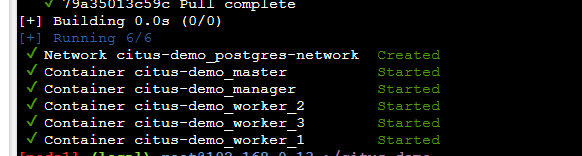
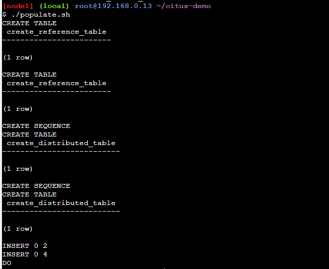
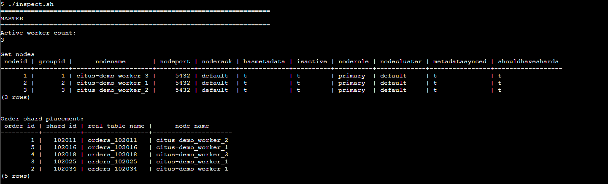
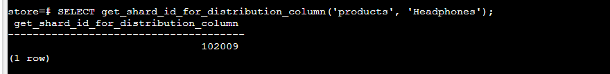
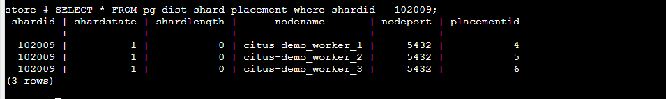
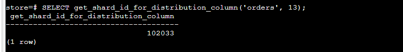
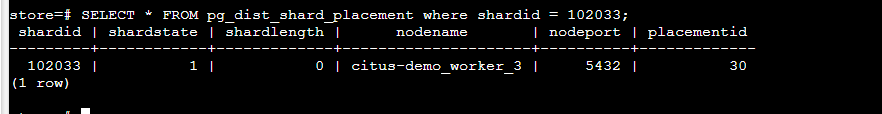

1. Jelaskan perbedaan replication dan sharding !
    Secara umum Replication adalah proses membuat salinan data di beberapa server untuk keandalan dan ketersediaan,
    sementara sharding adalah pembagian data menjadi bagian-bagian yang lebih kecil yang disimpan di beberapa node untuk meningkatkan kinerja dan skalabilitas.
    - Replikasi
        Beberapa data disalin di antara beberapa node
        Digunakan untuk Backup dan memastikan data yang tersedia selalu ada
    - sharding
        Data dibagi menjadi beberapa bagian dan didistribusikan ke beberapa node
        Digunakan untuk pemrosesan/penyimpanan terdistribusi
        Anda dapat menyimpan data lebih besar dari kapasitas node

2. Lakukan Percobaan untuk membuat reference table + distribute tabel pada repo github altera citus demo
    1. start jalankan perintah ./reset.sh untuk memastikan tidak ada docker yang berjalan
    2. lakukan perintah docker compose up -d

        

    3. kemudian jalankan ./populate.sh dijalankan untuk membuat reference table + distribute tabel pada database sehingga kita memiliki 4 table yaitu products,users,orders,order_details

        

    4. Jalankan perintah ./inspect.sh

        

3. Di node/ worker mana saja product Headphone tersimpan? Tunjukkan shard idnya .Dari perintah di gambar ini didapatkan table products berada pada shard id 102009

    

    Dari perintah di gambar di bawah ini untuk shard id 102009 terdapat di citus-demo_woker 1,2 dan 3

    
    
4. Di node/ worker mana saja order dengan id 13 tersimpan? Tunjukkan shard idnya. Dari perintah di gambar ini didapatkan table products berada pada shard id 102033

    

    Dari perintah di gambar di bawah ini untuk shard id 102033 terdapat di citus-demo_woker 3
    
    

5. Kapan sebaiknya kita menggunakan replication?
    Replication sebaiknya digunakan saat membutuhkan pencadangan data/backup data, ketersediaan tinggi/data yang harus selalu tersedia, distribusi data luas/global, atau untuk membagi beban kerja antara beberapa server.

6. Kapan sebaiknya kita menggunakan sharding?
    Sharding sebaiknya digunakan ketika kita perlu meningkatkan skalabilitas horizontal dari basis data, terutama dalam skenario di mana pertumbuhan data yang cepat dapat mengakibatkan peningkatan beban pada server. Dengan menerapkan sharding,kita bisa mendistribusikan data ke beberapa node atau server yang berbeda, memungkinkan sistem untuk menangani beban kerja yang lebih besar dengan cara yang efisien. Selain itu, sharding dapat bermanfaat saat Anda perlu meningkatkan kinerja dan mengurangi latensi untuk aplikasi yang memerlukan akses data yang cepat.