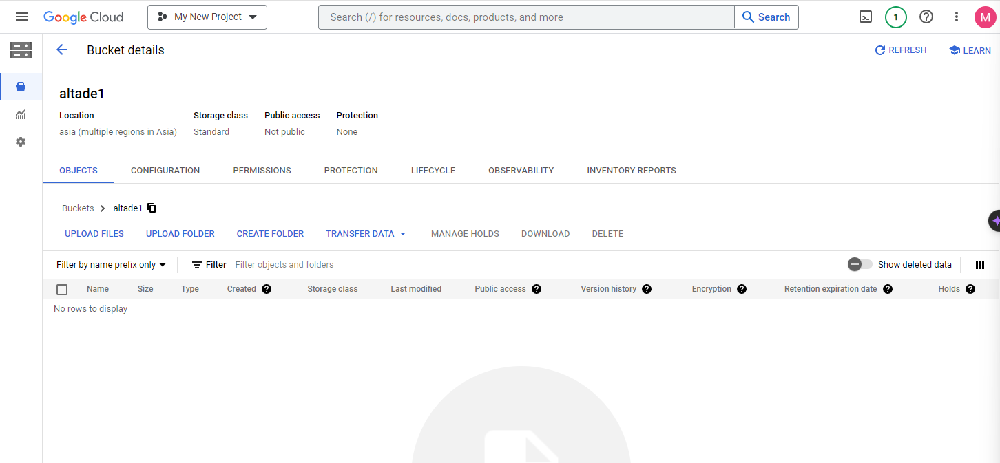
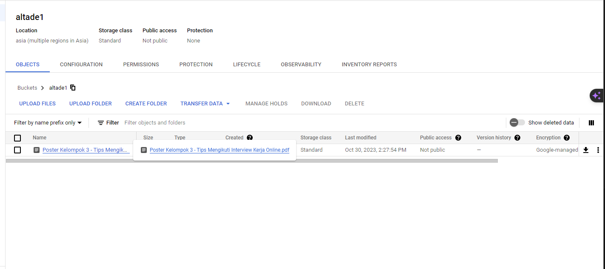
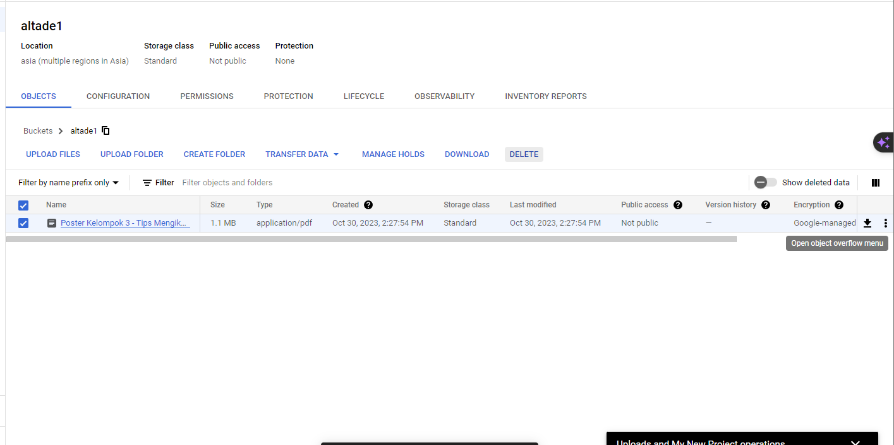
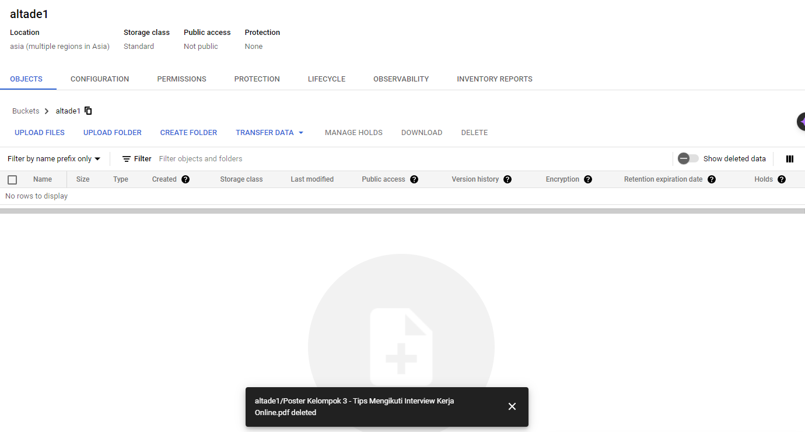
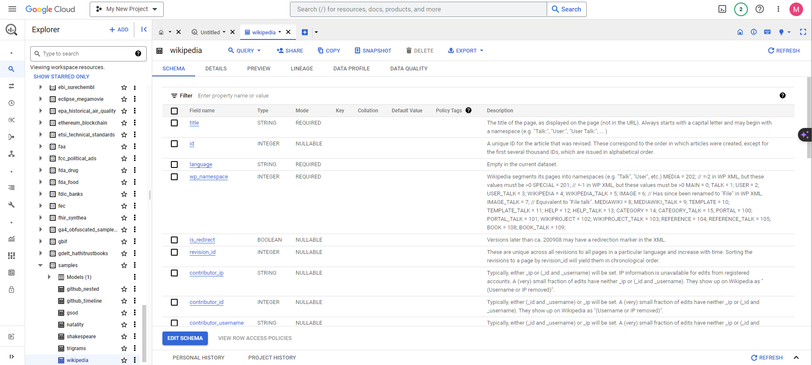
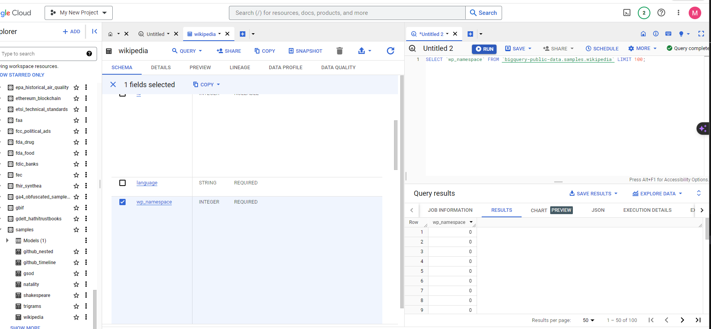
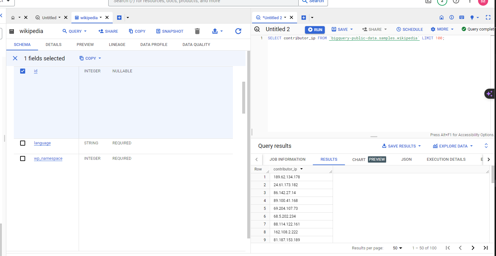
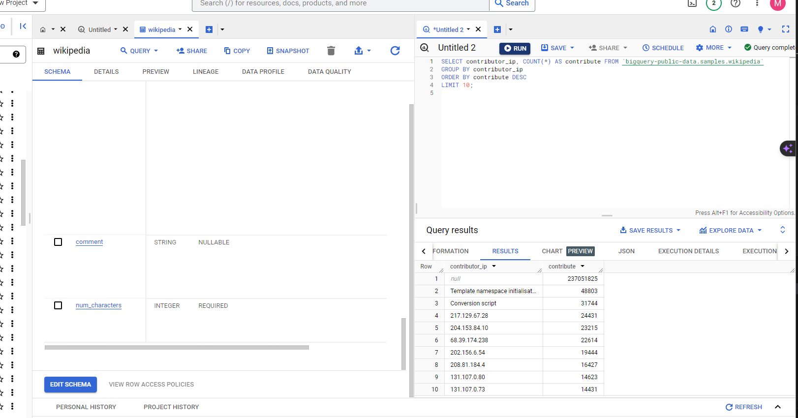

1. Buat sebuah bucket di GCS. upload beberapa file ke bucket tersebut 
    Masuk ke GCS kemudian search buckets dan pilih create. lengkapi form, jika sudah akan menjadi seperti ini :
    
    Kemudian pilih upload file dan pilih file yang akan di upload. Jika sudah terupload akan seperti gambar berikut:
    

2. Hapus file yang sudah diupload !
    Select file kemudian pilih delete
    
    

3. Lakukan eksplorasi sample data wikipedia (https://console.cloud.google.com/bigquery?p=bigquery-public-data&d=samples&t=wikipedia&page=table) dengan menggunakan big query 
    
    
    

4. Munculkan jumlah kontribusi dari masing-masing contributor_ip. urutkan dari kontribusi terbesar ke kontribusi terkecil 
    